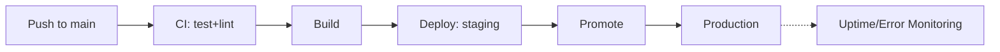

# 🏗️ Foundry — Production SaaS Reference Built with Cursor

   

> 💡 **Not a tutorial app — a real deploy pipeline, staging/prod split, and monitoring wired in.**



---

A production-deployed SaaS reference app built with Cursor, built while working through *Cursor AI Beginner to Pro: Build Production Web Apps with AI* — same architecture as the course's flashcard app, rebuilt around a different domain, with CI/CD and monitoring the course doesn't cover.

## 🧩 Sub-projects
- **`app/`** — the rebuilt application (own domain, own data model — not the course's flashcards)
- **`billing/`** — subscription/billing flow against a real (test-mode) payment provider
- **`.cursor/rules`** — a Cursor rules file tuned for this stack, committed and documented as a reusable artifact

## 🚀 Master Project
The app deployed with CI/CD (test → build → deploy on push to `main`), staging + prod environments, and basic uptime/error monitoring wired in. The README documents the Cursor workflow used to build it as a case study.

## ⚡ Quickstart
```bash
git clone <your-fork-url> && cd foundry
cp .env.example .env
./scripts/setup.sh
./scripts/dev.sh
```

## 🗺️ Roadmap
- [ ] App rebuilt on a new domain with the course's architecture pattern
- [ ] Billing flow in test mode
- [ ] `.cursor/rules` committed and documented
- [ ] CI/CD to staging + prod
- [ ] Uptime/error monitoring wired in
- [ ] "Cursor workflow" case-study section in the README

## 📈 At 10x Scale, I'd
Add a feature-flag layer so deploys and feature releases decouple, move background jobs (billing webhooks) off the request path into a queue, and add a synthetic-monitoring check that exercises the critical user path every few minutes.

## 🔍 Originality vs. the Course
The course builds a flashcard app; this repo keeps the architecture pattern but changes the domain, adds a real deploy pipeline, and documents the Cursor workflow as a transferable case study.

## 📄 License
MIT – see `LICENSE`.
